# katsu-magi 設計書

対象バージョン：0.1.0(フェーズ1)
最終更新：2026-09-21

## 1. この文書の位置づけ

この文書は、katsu-magi が「どう作られているか」を説明する。
「何をするか」は機能仕様書(`docs/functional-spec.md`)が定める。
以下、機能仕様書の機能 ID(F-01 など)を参照しながら、各機能を実現する構造を述べる。

## 2. 設計上の主要な判断

実装に入る前に決めた判断と、その根拠を先にまとめる。
以降の章は、これらの判断を前提にしている。

**API ではなくブラウザ自動操作を使う**。
利用者は各サービスの有料プランを契約しており、API の従量課金を追加で払いたくない。
また、Web 版固有の機能(検索、出典表示)を回答に含めたい。
代償として、画面構造の変化に追従する保守が必要になる。

**Playwright にブラウザを起動させず、Chrome を自ら起動して接続する**。
当初は Playwright の永続コンテキスト起動(`launchPersistentContext`)を使う設計だった。
しかし開発機では、Playwright が起動した Chrome が、ヘッドレスの有無や起動方法を変えても例外なく即座に異常終了した(終了コード 0xC0000005)。
一方、同じ chrome.exe をデバッグポート付きで普通に起動すると正常に動き、DevTools Protocol にも応答した。
そこで、Chrome の起動は子プロセスとして自ら行い、Playwright は DevTools Protocol 経由の接続(`connectOverCDP`)にだけ使う。
この方式には、起動フラグを完全に制御できるという副次的な利点がある。
Playwright が付けるテスト用フラグ(`--enable-automation` など)が無いため、ボット検知にも掛かりにくい。

**セレクタをコードから分離する**。
最も壊れやすいのはサイトの画面要素の特定であり、修正の頻度も高い。
セレクタは JSON ファイルにまとめ、キーごとに複数の候補を順に試す。
送信ごとに再読込するので、修正にサーバーの再起動は要らない。

**回答の完了判定は二つの条件を組み合わせる**。
停止ボタンの消失と、テキストの静止のどちらか一方では誤判定する場面がある(機能仕様書 F-04)。
判定ロジックは時計を差し替え可能な純粋な部品として切り出し、単体テストで検証する。

**サーバーからの回答は差分ではなく全文で送る**。
サイトの画面はストリーミング中に表示を書き換えることがあり、差分で送ると UI 側の再構成が複雑になる。
全文を毎回送っても、回答一つは数キロバイト程度であり、ローカル接続では問題にならない。

**オーケストレーション層をアダプタの上に置く**。
フェーズ2のマギモードは、複数サイトの回答を組み合わせる処理である。
アダプタ(一サイトの操作)と戦略(複数サイトの組み合わせ)を分けておけば、戦略ファイルの追加だけで拡張できる。

## 3. 全体アーキテクチャ

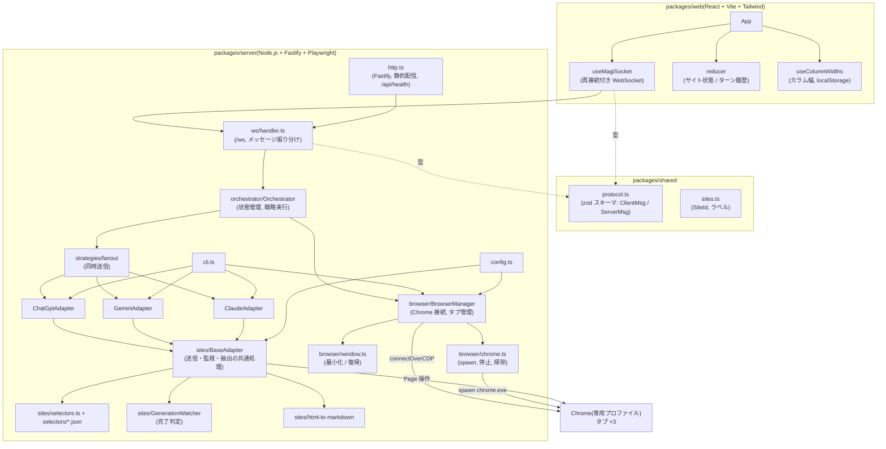

三つのパッケージの役割は次のとおりである。

- **shared**：UI とサーバーが共有する型と検証スキーマ。ビルドせず TypeScript のソースを両側から直接読み込む
- **server**：Chrome の制御、サイトの操作、UI との通信。単一の JavaScript にバンドルして配布する
- **web**：利用者が操作する画面。ビルド結果の静的ファイルをサーバーが配信する

## 4. ディレクトリ構成

```
katsu-magi/
  package.json                    ルート。dev / build / start / katsu-magi(CLI) スクリプト
  pnpm-workspace.yaml             packages/* をワークスペースにする。esbuild のビルド許可もここ
  tsconfig.base.json              全パッケージ共通の厳格な TypeScript 設定
  katsu-magi.config.example.json  設定の例。実際の設定は katsu-magi.config.json(git 管理外)
  scripts/
    postinstall.mjs               pnpm install 後に web をビルドする(KATSU_MAGI_SKIP_BUILD で抑止)
    start-chrome.cmd              connect モード用に Chrome を手動起動する
    package.mjs                   ポータブル zip を作る(12.1 節)
  release/                        package.mjs の出力と Node.js のキャッシュ(git 管理外)
  docs/                           この文書と機能仕様書
  packages/
    shared/src/
      sites.ts                    SiteId、表示名
      protocol.ts                 WebSocket メッセージの zod スキーマと型
    server/
      scripts/build.mjs           esbuild で dist/index.js と dist/cli.js を作る
      src/
        index.ts                  起動順序、終了処理
        cli.ts                    保守用コマンド
        config.ts                 設定の読み込みと検証、データディレクトリ
        logger.ts                 pino
        http.ts                   Fastify の生成、静的配信
        ws/handler.ts             /ws の受信・配信
        orchestrator/
          Orchestrator.ts         サイト状態、処理中管理、戦略の呼び出し
          strategies/fanout.ts    同時送信(runOne はマギモードでも再利用する)
        browser/
          BrowserManager.ts       接続、タブの払い出し、停止、再起動
          chrome.ts               chrome.exe の探索、spawn、CDP 待ち、終了、残骸の掃除
          window.ts               CDP で窓を最小化 / 復帰
        sites/
          types.ts                LlmSiteAdapter インターフェース、AdapterError、Reading
          selectors.ts            セレクタ JSON のスキーマと読み込み
          selectors/{chatgpt,gemini,claude}.json
          BaseAdapter.ts          送信・監視・抽出の共通実装
          chatgpt.ts / gemini.ts / claude.ts   サイト固有の上書き
          registry.ts             SiteId からアダプタを作る
          GenerationWatcher.ts    完了判定
          html-to-markdown.ts     Turndown による変換
      test/                       vitest(GenerationWatcher, Orchestrator, html-to-markdown)
    web/
      index.html, vite.config.ts  Vite(React, Tailwind プラグイン, /ws と /api のプロキシ)
      src/
        main.tsx, App.tsx, index.css
        ws/useMagiSocket.ts
        state/reducer.ts, state/useColumnWidths.ts
        components/{Toolbar,PromptBar,SiteColumn,StatusBadge,Markdown,ResizeHandle}.tsx
```

## 5. ブラウザ層

ブラウザ層は、Chrome への接続とタブの払い出しを担い、上位の層に「サイトごとの `Page`」だけを見せる。
`launch` と `connect` の二つのモードがあるが、アダプタはどちらで接続されたかを知らない。

### 5.1 起動と接続

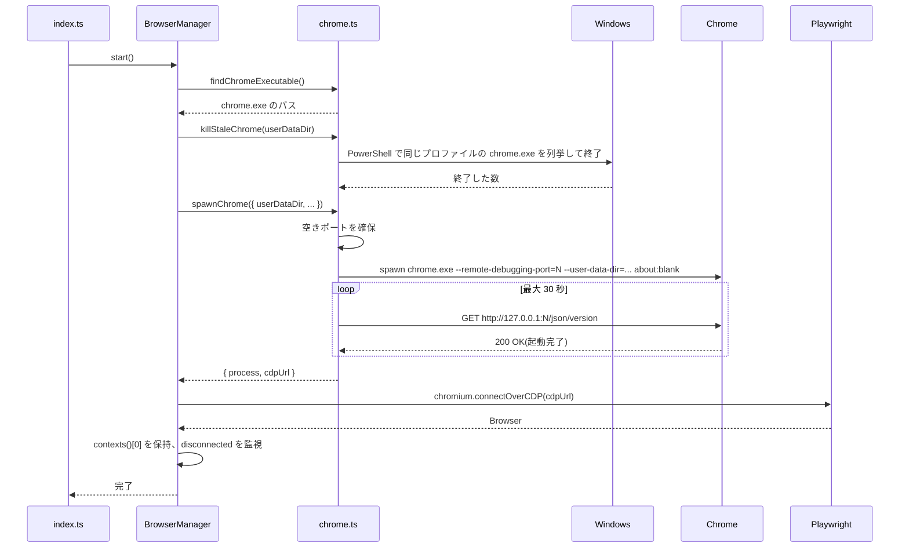

`launch` モードでは、起動時に同じプロファイルを掴む古い Chrome を終了させる。
前回のサーバーが強制終了されると Chrome が残り、プロファイルがロックされて次の起動が失敗するからである。
専用プロファイルは katsu-magi の所有物として扱い、他の用途で開かれていることは想定しない。

`connect` モードでは、利用者が `scripts/start-chrome.cmd` で起動した Chrome の `cdpUrl` に接続する。
停止時に Chrome を閉じないので、開発中にサーバーを再起動しても会話が維持される。

### 5.2 タブの払い出し

`getPage(site)` は、サイトごとに一つの `Page` を返す。
初回は、Chrome が起動時に開く `about:blank` のタブを再利用し、無ければ新しいタブを開く。
以後は同じ `Page` を返すので、サイトの会話はタブに紐づいて維持される(F-06)。
タブが閉じられると `pageClosed` イベントを出し、次回の `getPage` で新しいタブを開く。

### 5.3 窓の制御

ヘッドレスは使わないため、「Hide browser」は窓の最小化で実現する(F-12)。
Playwright には窓の状態を変える API が無いので、CDP セッションを開いて `Browser.setWindowBounds` を直接呼ぶ。

### 5.4 停止

`stop()` は Playwright の接続を切り、`launch` モードでは自ら起動した Chrome を `taskkill /T /F` でプロセスツリーごと終了させる。
`connectOverCDP` で得た `Browser` の `close()` は接続を切るだけで Chrome を終了させないため、明示的に殺す必要がある。
停止中に発生するタブ閉鎖のイベントは、警告として記録しない。

## 6. アダプタ層

アダプタ層は、一つのサイトの画面を操作して「プロンプトを送り、回答を読み取る」処理を、サイトの違いを吸収して提供する。

### 6.1 インターフェース

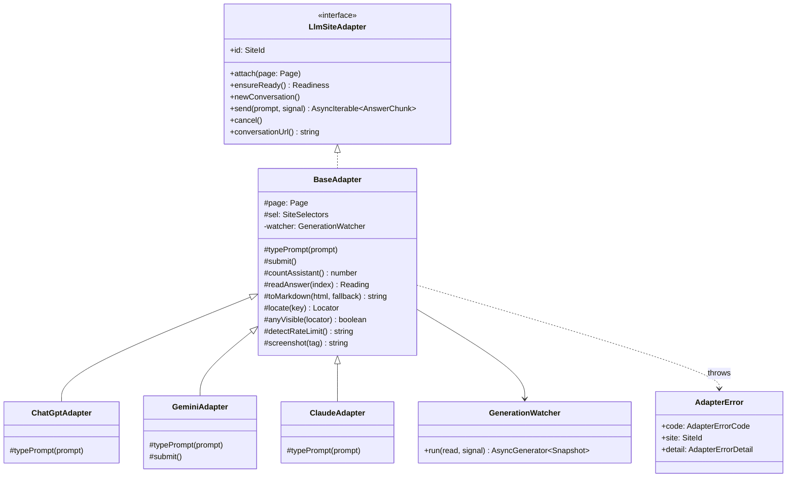

`send` は非同期イテレータを返す。
呼び出し側は `for await` で回答のスナップショットを順に受け取り、`done: true` の要素で完了を知る。
異常は `AdapterError` として投げられ、`code` で種類を、`detail` で診断情報(見つからなかったセレクタ、スクリーンショットの場所、部分的な回答など)を持つ。

サイト固有クラスが上書きしているのは、入力の方法と送信の待ち方だけである。
三サイトとも、ProseMirror や Quill といった contenteditable のエディタを使っており、Playwright の `fill()` が効かないか改行を失う。
そのため、全選択して削除した後にキーボード入力として文字列を挿入する。
Gemini はさらに、入力を Angular が認識してから送信ボタンが有効になるので、有効化を待ってからクリックする。

### 6.2 セレクタ JSON

サイトごとの JSON は次のキーを持つ。
候補配列のキーは、先頭から順に試し、最初に一致したものを使う。

| キー | 意味 |
|---|---|
| `urls.home` / `urls.newChat` | ホームと新規チャットの URL |
| `loginUrlPatterns` | URL に含まれていればログイン画面と見なす文字列 |
| `input` | プロンプト入力欄の候補 |
| `sendButton` / `stopButton` | 送信ボタンと停止ボタンの候補 |
| `assistantMessage` | 回答メッセージのコンテナの候補 |
| `messageBody` | コンテナ内の本文要素の候補(無ければコンテナ全体) |
| `loginIndicator` | ログイン画面の印(ボタンなど)の候補 |
| `challengeIndicator` | Cloudflare などの確認画面の印 |
| `rateLimitPatterns` | 利用上限メッセージの正規表現(大文字小文字を区別しない) |
| `stripFromHtml` | 回答 HTML から除く要素(ボタン、出典カルーセルなど) |
| `doneAttribute` | 完了を示す属性(Claude の `data-is-streaming="false"`)。任意 |

各サイトの画面は日本語で表示されるため、`aria-label` に基づく候補は日本語(「送信」「停止」)と英語の両方を持つ。
候補の先頭には、変わりにくい `data-testid` や `id` を置く。

JSON は zod スキーマで検証し、不正なファイルは起動時と送信時にエラーになる。

### 6.3 送信から回答までの流れ

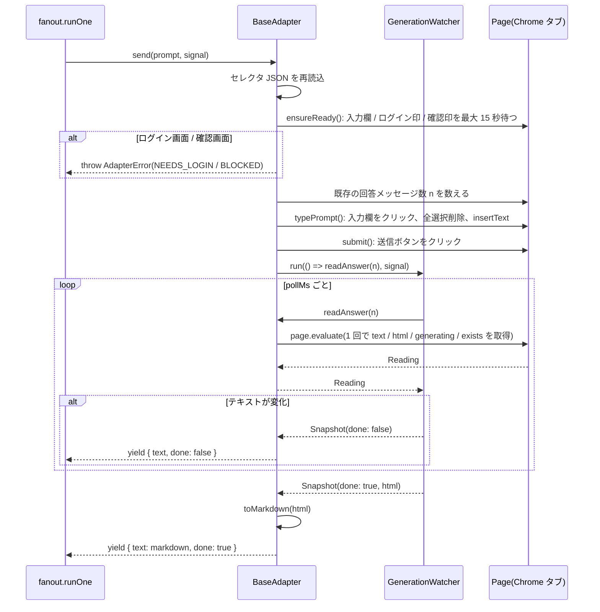

`readAnswer` は、一回の `page.evaluate` で必要な情報をすべて取る。
ポーリングのたびに複数回ブラウザと往復すると、その分だけ遅延と負荷が増えるためである。
評価関数の中では、n+1 番目の回答コンテナを見つけ、本文要素の `innerText`(表示用)と、`stripFromHtml` の要素を取り除いた複製の `innerHTML`(変換用)を返す。
生成中かどうかは、停止ボタンが画面上に描画されているか、`doneAttribute` があればその値で決める。

### 6.4 完了判定

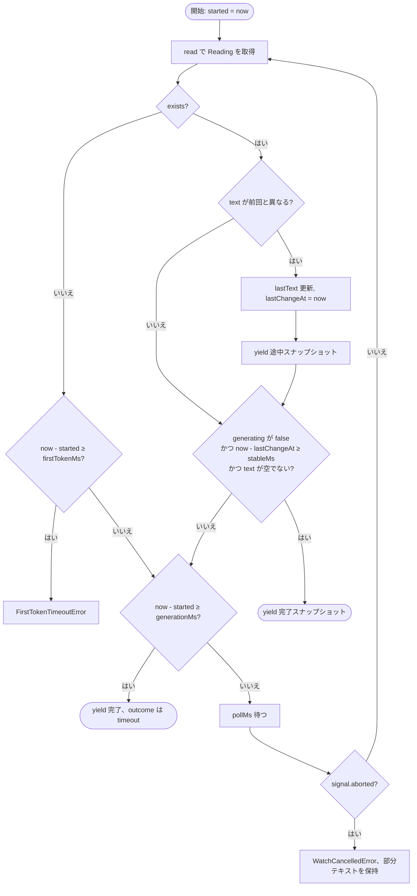

この部品は Playwright に依存せず、`read`、現在時刻、待機の三つを外から注入する。
単体テストでは、偽の時計と読み取り結果の列を与えて、静止後の完了、停止ボタンのちらつき、初回タイムアウト、生成タイムアウト、キャンセルを検証している。

`BaseAdapter` は、この部品が投げる例外を `AdapterError` に変換する。
初回タイムアウトのときは、先に利用上限のパターンを画面から探し、見つかれば `RATE_LIMITED`、無ければ `TIMEOUT_FIRST_TOKEN` にする。
キャンセルのときは停止ボタンを押し、部分テキストを `detail.partialText` に載せて `CANCELLED` にする。

### 6.5 HTML から Markdown への変換

変換は Turndown(GFM プラグイン付き)で行い、次の三つの規則を追加している。

1. `<pre>` 内の `<code>` だけを取り出して fenced コードブロックにし、言語名は `language-xxx` クラスから拾う。クラスが無ければ、`<pre>` 内で `<code>` の外にあるテキストノード(ChatGPT のコードブロック見出し)のうち、既知の言語名に一致するものを使う
2. 箇条書きの記号の後の空白を一つにする(Turndown の既定は三つ)
3. 変換後、コードブロックの直前に単語一つで置かれた既知の言語名(Gemini や Claude のラベル)を取り除き、フェンスに言語名が無ければそこに入れる

既知の言語名の一覧で判定するのは、「Result」のような普通の一語の段落まで取り除かないためである。
これらの規則は、実際のサイトの回答 HTML を試験データとして単体テストで確認している。

## 7. オーケストレーション層

### 7.1 Orchestrator

`Orchestrator` は、サイトごとの状態(有効か、現在の `SiteStatus`、補足メッセージ)と、処理中のリクエストを一つだけ保持する。
UI に届くすべての通知は、この層が `message` イベントとして出す `ServerMsg` である。

主な操作は次のとおりである。

- `attachAll()`：起動時と再起動時に、全アダプタをタブに結び付けて状態判定する(F-01)
- `ask(requestId, prompt, sites)`：処理中なら `BusyError`。そうでなければ戦略を実行する(F-03)
- `cancel(requestId)`：処理中のリクエストの `AbortSignal` を中断する(F-09)
- `newConversation(sites)`：各アダプタを新規チャットに移して状態判定する(F-07)
- `retry(site)`：タブを取り直して状態判定する(F-11)
- `setEnabled`、`setBrowserVisible`、`restartBrowser`

### 7.2 fanout 戦略

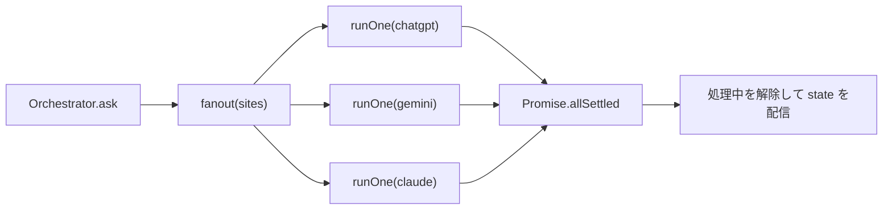

`runOne` は一サイトを最後まで実行し、アダプタの出力を三種類のコールバック(`onStatus`、`onAnswer`、`onError`)に変換する。
決して例外を外に出さず、失敗は `onError` で報告する。
そのため、一つのサイトが失敗しても他のサイトの `runOne` は影響を受けない。

マギモードは、この `runOne` を使って検証ラウンドと統合ラウンドを回す戦略として、`strategies/magi.ts` に追加する予定である。
`Orchestrator` 側の変更は、どの戦略を呼ぶかの分岐だけになる。

### 7.3 エラーから状態への写像

アダプタの `AdapterError.code` は、次のように `SiteStatus` に写す。

| code | SiteStatus | 補足 |
|---|---|---|
| NEEDS_LOGIN | needs-login | Chrome を前面に出す |
| BLOCKED | blocked | Chrome を前面に出す |
| RATE_LIMITED | rate-limited | 検出した文言をメッセージにする |
| CANCELLED | idle | メッセージ無し。部分テキストは回答として配信する |
| SELECTOR_NOT_FOUND | error | 見つからなかったキーと点検コマンドをメッセージにする |
| TIMEOUT_FIRST_TOKEN / TIMEOUT_GENERATION / PAGE_CLOSED / UNKNOWN | error | 例外のメッセージをそのまま示す |

`detail.partialText` があれば、状態を変える前に `answer`(done: true)として配信する。
利用者がキャンセルやタイムアウトの後でも、それまでの回答を読めるようにするためである。

## 8. 通信プロトコル

UI とサーバーは、単一の WebSocket(`/ws`)で JSON メッセージを交換する。
メッセージの形は `packages/shared/src/protocol.ts` の zod スキーマで定義し、両側で同じスキーマを使って検証する。
サーバーは、`Orchestrator` の全通知を接続中の全クライアントに配信する。
複数のブラウザタブで UI を開いても表示が揃うのはこのためである。

UI からサーバーへ(`ClientMsg`)：

| type | フィールド | 意味 |
|---|---|---|
| hello | - | 現在の `state` を要求 |
| prompt | requestId, text, sites | 送信(F-03) |
| cancel | requestId | キャンセル(F-09) |
| newConversation | sites? | 新しい会話(F-07) |
| retry | site | 状態判定のやり直し(F-11) |
| setSiteEnabled | site, enabled | 有効/無効(F-08) |
| browser | action: show / hide / restart | ブラウザ制御(F-12) |

サーバーから UI へ(`ServerMsg`)：

| type | フィールド | 意味 |
|---|---|---|
| state | sites, browser, busyRequestId? | 全体の現在状態。接続時と、処理の開始・終了、有効/無効の変更時に送る |
| siteStatus | site, status, message? | 一サイトの状態変化 |
| answer | requestId, site, text, done | 回答の全文スナップショット |
| error | site?, requestId?, code, message, selectorKey? | エラー。site 無しは全体のエラー(BUSY、不正メッセージ) |

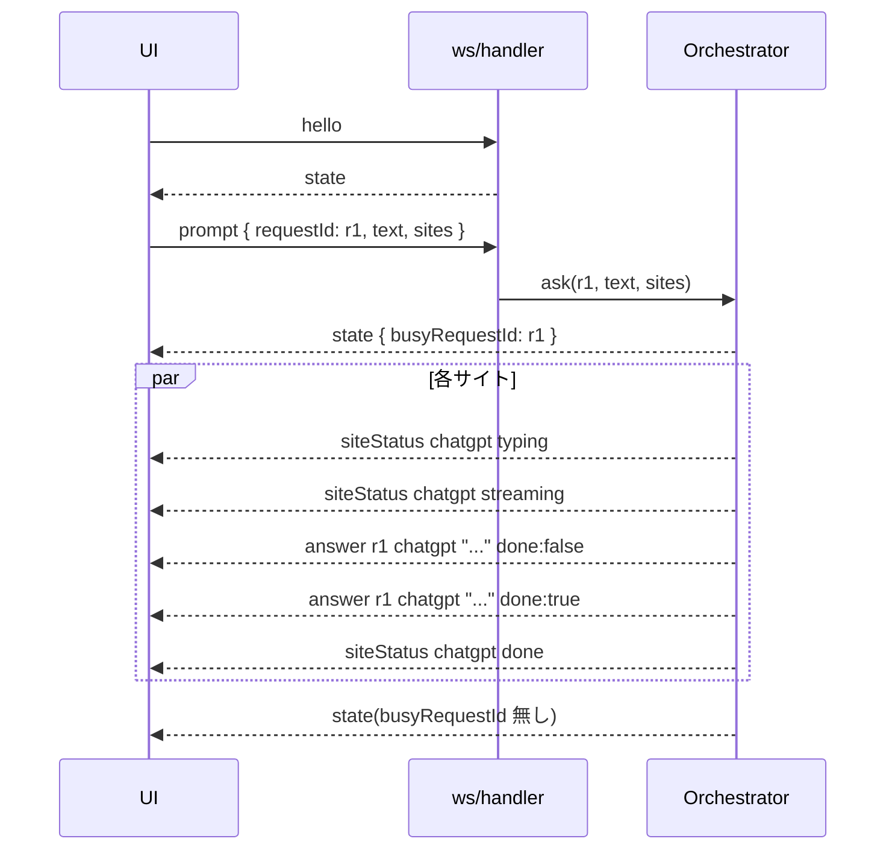

## 9. サーバーの起動順序と終了

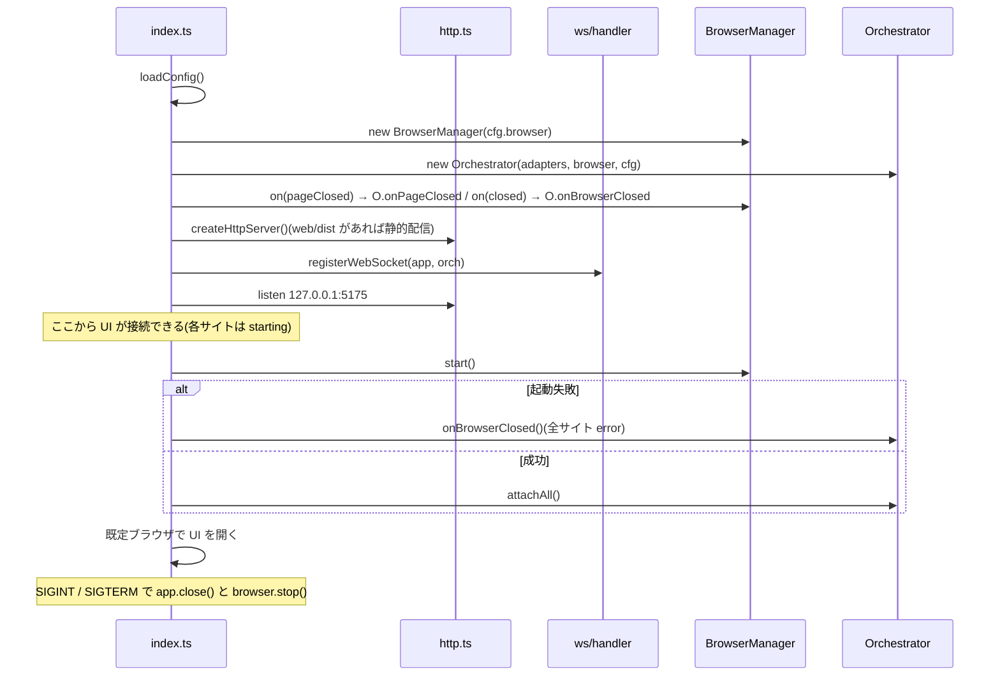

HTTP サーバーを Chrome より先に立てるのは、Chrome の起動(数秒)を待たずに UI を表示し、「starting」を見せるためである。

## 10. フロントエンド

### 10.1 コンポーネントとデータの流れ

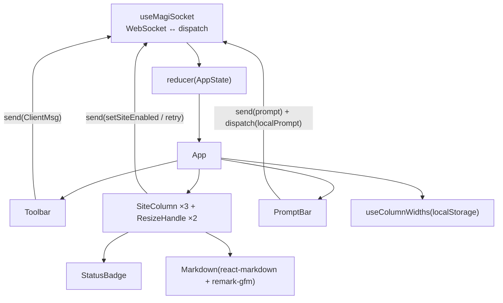

状態は一つの `useReducer` に集約する。

```ts
AppState = {
  connected: boolean
  sites: Record<SiteId, { enabled, status, message? }>
  browser: { running, visible }
  busyRequestId?: string
  turns: Turn[]        // { requestId, prompt, sites, answers: { [site]: { text, status, error? } } }
  notice?: string      // BUSY などの一時通知
}
```

サーバーからの `ServerMsg` はそのまま `server` アクションとして reducer に渡す。
`siteStatus` はサイトの状態を更新するだけでなく、処理中のターンの該当サイトの状態にも写す。
カラムは全ターンを表示するため、ターンごとに「そのときの状態」を持たせている。

プロンプト送信時は、サーバーへ送るのと同時に `localPrompt` アクションでターンを先に追加する。
サーバーからの最初の応答を待たずに、利用者の入力が即座に画面に現れるようにするためである。
`requestId` は UI 側で UUID を生成し、以後の `answer` と `error` をこのターンに結び付ける。

### 10.2 WebSocket の再接続

`useMagiSocket` は、切断されると 0.5 秒から始めて最大 8 秒まで間隔を倍にしながら再接続する。
接続前に送られたメッセージはキューに入れ、接続後にまとめて送る。
受信したメッセージは zod スキーマで検証し、形が合わないものは無視して警告を出す。

### 10.3 レイアウトとカラム幅

三つのカラムは横並びの flex コンテナに置き、各カラムの `flex-grow` に保存された比率(合計 1)を与える。
`flex-basis` を 0 にしているので、仕切り(固定幅 12px)を除いた残りの幅が比率どおりに配分される。
`useColumnWidths` は比率の配列を持ち、仕切りの `pointerdown` からドラッグ量を「コンテナ幅に対する割合」に換算して両隣の比率を増減する。
比率は変更ごとに localStorage に保存する。

### 10.4 Markdown の描画

react-markdown は既定で生の HTML を描画しないため、サイトの回答に含まれる HTML がそのまま実行されることはない。
リンクと画像だけ、描画部品を差し替えている。

- リンクはすべて `target="_blank"` と `rel="noopener noreferrer"` を付ける
- URL に `utm_source=chatgpt.com` を含むリンクは、ChatGPT の出典表示に合わせたピル型にする
- URL に `favicon` を含む画像は 14 ピクセルのインラインアイコンにする

## 11. 設定と保存場所

| 種類 | 場所 | 内容 |
|---|---|---|
| 設定 | `katsu-magi.config.json`(または `KATSU_MAGI_CONFIG`) | 機能仕様書 F-17 |
| セレクタ | 環境変数 `KATSU_MAGI_SELECTORS_DIR`、無ければ `packages/server/src/sites/selectors/*.json`、無ければバンドルに隣接する `selectors/` | 6.2 節。この順に探す。ポータブル版では起動用 cmd が環境変数で zip 最上位の `selectors/` を指す |
| Chrome プロファイル | `%LOCALAPPDATA%\katsu-magi\chrome-profile` | ログイン情報、Cookie |
| ログとスクリーンショット | `%LOCALAPPDATA%\katsu-magi\logs\` | 状態判定失敗、セレクタ不一致、初回タイムアウト時の画面 |
| カラム幅 | ブラウザの localStorage(`katsu-magi.columnWidths.v1`) | 比率の配列 |

設定は zod スキーマで検証し、未指定の項目に既定値を入れる。
`%VAR%`、`$VAR`、`${VAR}` の形の環境変数参照を展開してからパスを解決する。

## 12. ビルドと配布

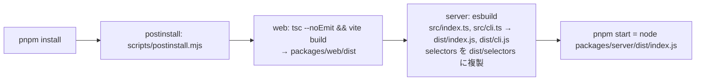

サーバーは esbuild で単一ファイルにバンドルする。
`@katsu-magi/shared` は TypeScript のソースしか持たないため、tsc の出力をそのまま Node で動かすと共有パッケージの解決に失敗する。
バンドルすれば共有パッケージはサーバーの出力に取り込まれ、他の依存(playwright-core、fastify など)は外部参照のまま `node_modules` から読まれる。

開発時は `pnpm dev` で、サーバーを tsx の監視実行、UI を Vite の開発サーバー(5173 番)で動かす。
Vite は `/ws` と `/api` を 5175 番へ中継する。

`postinstall` は環境変数 `KATSU_MAGI_SKIP_BUILD` か `CI` があればビルドを省く。

### 12.1 ポータブル配布

開発環境を持たない人に渡すために、`pnpm package`(`scripts/package.mjs`)が Windows 向けのポータブル zip を作る。

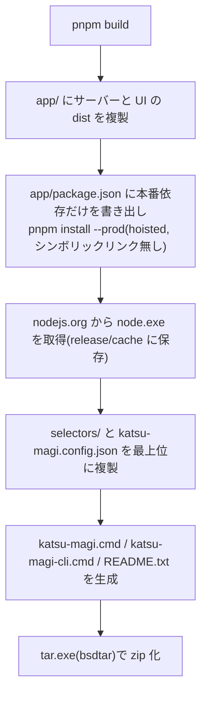

配布物の構造は、リポジトリと同じ `app/packages/server/dist` と `app/packages/web/dist` の相対位置を保つ。
サーバーが UI の場所を自身の位置から `../../web/dist` で探すためである。

依存パッケージは、pnpm の既定(シンボリックリンクで `.pnpm` 配下を指す)ではなく、平坦な `node_modules` に展開する(`node-linker=hoisted`)。
シンボリックリンクは zip 化と展開で失われたり、Windows で権限を要求したりするからである。
パッケージ作成スクリプトは、最上位にシンボリックリンクが残っていれば失敗する。

起動用 cmd は、自身の位置を基準に環境変数 `KATSU_MAGI_CONFIG` と `KATSU_MAGI_SELECTORS_DIR` を設定してから同梱の Node.js でサーバーを起動する。
これにより、受け取った人は最上位の `selectors/*.json` を上書きするだけでセレクタを更新できる。
cmd 内の表示は英語のみにしている。cmd.exe はバッチファイル中の多バイト文字をコードページによって誤って解釈するためで、日本語の案内は `README.txt` に置く。

## 13. テスト

| 層 | 方法 | 対象 |
|---|---|---|
| 単体 | vitest | GenerationWatcher(偽の時計で 5 ケース)、html-to-markdown(実サイト由来の HTML 断片)、Orchestrator(偽アダプタで並列、失敗の隔離、BUSY、キャンセル、無効サイト)、protocol スキーマ |
| アダプタ | CLI `adapter:test` | 実サイトに対する送信、ストリーミング、Markdown、`--then` による会話継続 |
| セレクタ | CLI `selectors:check` / `selectors:probe` | 実サイトの画面との一致 |
| 結合 | サーバーを起動し WebSocket でプロンプトを送る | 三サイト同時送信から回答受信まで(開発時に手動で実施) |
| 配布物 | zip を別フォルダに解凍し、起動用 cmd から立ち上げる | 同梱 Node.js での起動、依存の解決、セレクタと設定の参照先、三サイトの状態判定(zip を作り直したときに手動で実施) |
| UI | 手動 | 表示、ドラッグ、リンク、状態バッジ |

アダプタの試験は、利用者のアカウントに実際の会話を作る。
自動テストには組み込まず、画面構造の変化を疑ったときに手で実行する。

## 14. 既知の課題と拡張の方針

- **履歴の永続化**：UI のターン履歴を再読み込みで失う。localStorage か、サーバー側での保存(会話 URL と合わせて)で復元できるようにする案がある
- **サイトの追加**：`SITE_IDS` に ID を足し、セレクタ JSON とアダプタクラスを一つずつ書き、`registry.ts` に登録する。UI は `SITE_IDS` を基にカラムを描くので、そのまま増える
- **マギモード**：`strategies/magi.ts` を追加し、独立回答、相互検証、統合の三段階を `runOne` で回す。UI には結論を示す四つ目の領域が要る
- **プロセス終了時の後始末**：サーバーが強制終了されると Chrome が残る。次回起動時に掃除する対処を入れているが、終了と同時に Chrome を閉じる手段(ジョブオブジェクトなど)は Node からは扱いにくい
- **他プラットフォーム**：Chrome の探索と残骸の掃除は Windows を前提に書いている。macOS と Linux は探索パスだけ用意し、掃除は行わない
