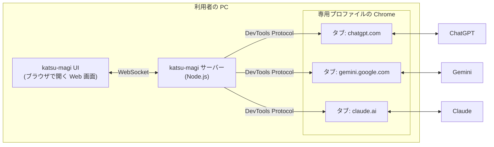
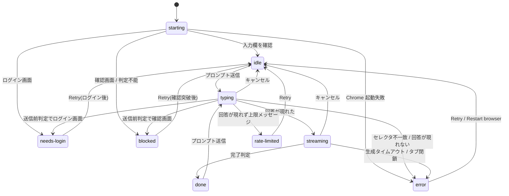
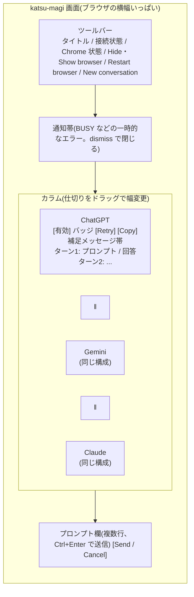

# katsu-magi 機能仕様書

対象バージョン：0.1.0(フェーズ1)
最終更新：2026-09-21

## 1. この文書の位置づけ

この文書は、katsu-magi が「何をするか」を定める。
「どう作られているか」は別冊の設計書(`docs/design.md`)が扱う。
両方の文書で、同じ用語を同じ意味で使う。

## 2. 背景と目的

調べものの精度を上げるには、複数の LLM に同じ質問を投げて回答を見比べるのが有効である。
一つの LLM の回答だけでは、もっともらしい誤り(ハルシネーション)を見抜きにくいからだ。
しかし、ブラウザのタブを三つ開いて同じ質問を三回貼り付けるのは手間がかかる。
既存のブラウザ拡張(ChatHub)は非公式な経路で各サービスにアクセスするため、セッションが頻繁に切れ、実質的に一つのサービスしか使えない状態になっていた。

katsu-magi は、この手間と不安定さを取り除く。
利用者がログイン済みの本物の Chrome を自動操作し、ChatGPT、Gemini、Claude の正規サイトに同じプロンプトを同時に送って、回答を一つの画面に並べる。
API を使わないので追加課金はなく、各サービスの契約プランをそのまま使える。

名前は『新世紀エヴァンゲリオン』の MAGI システムに由来する。
三つの独立した知性に同じ問いを投げ、見比べて結論を出す、という発想を借りている。

## 3. 用語

- **サイト**：自動操作の対象となる LLM サービスの Web サイト。フェーズ1では ChatGPT(chatgpt.com)、Gemini(gemini.google.com)、Claude(claude.ai)の三つ。
- **サイト ID**：サイトを識別する文字列。`chatgpt`、`gemini`、`claude`。
- **アダプタ**：一つのサイトの画面操作(入力、送信、回答の読み取り)を担う部品。サイトごとに一つ。
- **プロファイル**：katsu-magi 専用の Chrome ユーザーデータディレクトリ。ログイン情報はここに保存され、利用者が普段使う Chrome とは分離される。
- **ターン**：利用者のプロンプト一つと、それに対する各サイトの回答の組。
- **会話**：各サイト上のチャットスレッド。ターンを重ねると同じ会話に追記される。
- **セレクタ**：サイトの画面要素(入力欄、送信ボタンなど)を特定する CSS セレクタ。サイトごとに JSON ファイルで管理する。
- **マギモード**：三サイトの独立回答をもとに相互検証と統合を行う将来機能。フェーズ1の対象外。

## 4. 対象範囲

フェーズ1で提供する範囲は、次のとおりである。

- 一つのプロンプトを、有効な全サイトに同時送信する
- 各サイトの回答を、生成中からリアルタイムに横並びで表示する
- 追い質問を各サイトの同じ会話に送る
- ログイン要求、ボット検知、利用上限、画面構造の変化といった異常を検知し、利用者に対処を促す
- 画面構造の変化に追従するための保守用コマンドを提供する

次のものは対象外とする。

- 各サービスの API 利用
- マギモード(相互検証、統合)
- サイトごとのモデル選択
- 画像や添付ファイルの送信
- 回答履歴の永続化(画面を再読み込みすると表示上の履歴は消える。各サイト側の会話は残る)

## 5. システムの全体像

利用者が触るのは UI だけである。
サーバーは UI からプロンプトを受け取り、Chrome の各タブに入力して送信し、画面に現れる回答を読み取って UI に流す。
各サイトから見れば、利用者がブラウザで操作しているのと同じ通信になる。

## 6. 利用者と利用環境

想定する利用者は、katsu-magi を自分の PC で動かす個人である。
配布先も同様に、各自の PC に導入して各自のアカウントで使う。
導入の形は二つある。開発者はリポジトリを取得して `pnpm install` で動かし、開発環境を持たない人は Node.js を同梱したポータブル zip(F-18)を受け取る。
サーバーは `127.0.0.1` にのみ待ち受け、他の端末からはアクセスできない。

動作環境は次のとおりとする。

- Windows 10/11(macOS、Linux は動作を想定するが未検証)
- Google Chrome(インストール済みのもの)
- Node.js 20 以上、pnpm
- 各サービスのアカウント

## 7. 機能一覧

| ID | 機能 | 概要 |
|---|---|---|
| F-01 | 起動 | サーバー起動時に Chrome を立ち上げ、三サイトのタブを開き、状態を判定する |
| F-02 | 初回ログイン | 専用プロファイルで各サイトにログインする手順を提供する |
| F-03 | 同時送信 | プロンプトを有効な全サイトに同時に送る |
| F-04 | ストリーミング表示 | 生成途中の回答を逐次表示する |
| F-05 | Markdown 整形 | 完了した回答を Markdown に整形して表示する |
| F-06 | 会話継続 | 追い質問を各サイトの同じ会話に送る |
| F-07 | 新しい会話 | 全サイトを一括で新規チャットにする |
| F-08 | サイトの有効/無効 | 送信対象からサイトを外す、戻す |
| F-09 | キャンセル | 生成中の回答を全サイトで停止する |
| F-10 | 状態表示 | サイトごとの状態をバッジで示す |
| F-11 | 異常検知と Retry | ログイン要求、ボット検知、利用上限、セレクタ不一致を検知し、Retry で復帰する |
| F-12 | ブラウザ制御 | Chrome 窓の最小化/復帰、再起動 |
| F-13 | 回答のコピー | 最新回答を Markdown としてクリップボードに複写する |
| F-14 | カラム幅の変更 | カラムの境界をドラッグして幅を変え、次回起動時も維持する |
| F-15 | リンクの扱い | 回答内のリンクを別タブで開く。出典アイコンは小さく文中に表示する |
| F-16 | 保守用 CLI | ログイン、アダプタ単体試験、セレクタ点検、DOM 調査、HTML 保存、Inspector 起動 |
| F-17 | 設定 | ポート、ブラウザ起動方式、サイト有効状態、タイムアウトを JSON で設定する |
| F-18 | ポータブル配布 | Node.js を同梱した zip を作り、開発環境の無い人に渡す |

## 8. 機能仕様

### F-01 起動

`pnpm start`(本番)または `pnpm dev`(開発)で起動する。

1. 設定ファイルを読み込む。無ければ既定値で動く。
2. HTTP サーバーを `127.0.0.1:5175` で待ち受ける。UI はこの時点で接続でき、各サイトは「starting」と表示される。
3. 専用プロファイルを掴んでいる古い Chrome プロセスがあれば終了させる。前回のサーバーが強制終了された場合の残骸を掃除するためである。
4. Chrome を起動し、接続する。
5. サイトごとにタブを一つ開き、ホーム画面に移動して状態を判定する(F-10)。
6. 本番モードでは、既定のブラウザで UI を開く。環境変数 `KATSU_MAGI_NO_OPEN` があれば開かない。

Chrome の起動に失敗した場合、全サイトを「error」とし、原因(プロファイルの競合、実行ファイル不在など)をメッセージに示す。
UI は動き続け、「Restart browser」で再試行できる。

### F-02 初回ログイン

`pnpm katsu-magi login` を実行すると、専用プロファイルの Chrome が開き、三サイトのタブが表示される。
利用者は各タブでログインし、ターミナルで Enter を押す。
コマンドは各サイトの状態を判定して表示し、Chrome を閉じる。
ログイン情報はプロファイルに保存されるため、次回以降の起動ではログイン済みの状態から始まる。

### F-03 同時送信

利用者が入力欄にプロンプトを書き、Send(または Ctrl+Enter)を押す。

- 送信先は、その時点で有効(F-08)な全サイト。有効なサイトが無ければ送信できない。
- 一度に処理できるプロンプトは一つ。処理中に別のプロンプトを送ると、サーバーは「BUSY」エラーを返し、UI に通知を表示する。
- 各サイトへの送信は並列に行い、一つのサイトの失敗は他のサイトに影響しない。
- 送信は、必ず画面上の送信ボタンをクリックして行う。Enter キーは、改行として扱うサイトがあるため使わない。
- 改行を含むプロンプトは、改行を保ったまま入力する。

送信したプロンプトは、各カラムの上部に吹き出しとして表示される。

### F-04 ストリーミング表示

送信後、各サイトの回答欄を一定間隔(既定 300 ミリ秒)で読み取り、変化があるごとに UI に送る。
UI 側は、回答のテキストをその都度置き換えて表示する(差分ではなく全文を毎回送る)。
表示中のカラムは自動で最下部までスクロールする。

回答の完了は、次の三条件がすべて満たされたときと判定する。

1. 回答メッセージの要素が存在する
2. 生成中を示す表示(停止ボタン、あるいはサイト固有の属性)が消えている
3. テキストが一定時間(既定 1.5 秒)変化しておらず、空でない

停止ボタンの消失だけでは、ChatGPT がツール呼び出しの合間に一瞬ボタンを隠す場面で誤判定する。
テキストの安定だけでは、長い「思考中」の間で誤判定する。
両方を組み合わせることで、どちらの誤判定も避ける。

タイムアウトは二段階で設ける。

- 送信後、既定 45 秒たっても回答要素が現れない場合、利用上限のメッセージを探し(F-11)、見つからなければ「回答が現れない」エラーにする
- 回答が始まっても既定 240 秒で完了しない場合、その時点までの内容を確定させたうえで「生成が完了しない」エラーにする

### F-05 Markdown 整形

回答が完了すると、サイトの画面から回答部分の HTML を取り出し、Markdown に変換して表示を置き換える。
生成中の表示は素のテキストなので、完了時に見出し、箇条書き、表、コードブロックが整った形に変わる。

変換では次を行う。

- コピー用ボタン、出典カルーセル、装飾アイコンなど、回答本文でない要素を除く(サイトごとに除去対象をセレクタで指定する)
- コードブロックは fenced 形式にし、言語名を保つ。言語名は、`language-xxx` クラス、ChatGPT のコードブロック見出し、Gemini や Claude がブロックの直前に置くラベルのいずれかから拾う
- ブロックの直前に単語一つで置かれた言語ラベル(「Python」など)は本文から取り除き、フェンスの言語名に折り込む。一般の単語(「Result」など)は残す
- 表は GitHub 方式のパイプ区切りにする
- 変換に失敗した場合は、素のテキストをそのまま表示する

### F-06 会話継続

各サイトのタブは開いたまま維持されるため、次のプロンプトは同じ会話に追記される。
利用者が「今の回答を要約して」のような追い質問をすると、各サイトはそれぞれの直前の回答を踏まえて答える。
UI のカラムには、そのサイトに送った全ターンが上から順に並ぶ。

### F-07 新しい会話

「New conversation」を押すと、確認ダイアログの後、有効な全サイトを新規チャットの URL に移動させる。
UI 上のターン履歴は消える。
各サイト側の過去の会話は残る。
処理中(F-03)には実行できない。

### F-08 サイトの有効/無効

各カラムの見出しにあるチェックボックスで、サイトを送信対象から外せる。
無効なサイトのカラムは薄く表示され、以降のプロンプトは送られない。
処理中は切り替えられない。
初期値は設定ファイル(F-17)で決まる。

### F-09 キャンセル

処理中は Send ボタンが Cancel ボタンに変わる。
押すと、全サイトで停止ボタンをクリックし、それまでに得た部分的な回答を残して処理を終える。
キャンセルしたサイトの状態は「idle」に戻る。

### F-10 状態表示

サイトごとに、次の状態のいずれかを持ち、カラムの見出しにバッジで示す。

| 状態 | 意味 | 表示色 |
|---|---|---|
| starting | 起動処理中 | 灰 |
| idle | 送信可能 | 緑 |
| typing | プロンプトを入力中 | 青(点滅) |
| streaming | 回答を受信中 | 青(点滅) |
| done | 直前のターンが完了 | 緑 |
| needs-login | ログイン画面が表示されている | 黄 |
| blocked | Cloudflare などの確認画面、または判定不能な画面 | 橙 |
| rate-limited | 利用上限のメッセージを検出 | 赤 |
| error | セレクタ不一致、タイムアウト、タブ閉鎖など | 赤 |

状態に補足メッセージがあれば、バッジの下に帯で表示する。

状態の遷移を次に示す。

### F-11 異常検知と Retry

送信の前と起動時に、各サイトの画面を判定する。
判定は、入力欄、ログイン画面の印、確認画面の印のうち、どれが先に表示されるかを最大 15 秒待って行う。

- URL がログイン用のパターンに一致する、またはログイン画面の印(ログインボタンなど)が表示されていれば「needs-login」
- 確認画面の印(Cloudflare のチャレンジなど)が表示されていれば「blocked」
- 入力欄が表示されていれば送信可能
- どれにも当たらなければ「blocked(判定不能)」とし、スクリーンショットを保存する

ログイン画面の印は、入力欄より優先する。
Gemini のように、ログインしていなくても匿名で使える入力欄を出すサイトがあり、利用者は自分のアカウントでの回答を求めているからである。

needs-login と blocked では、サーバーが Chrome の窓を前面に出し、該当タブを表示する。
利用者は Chrome 上で対処(ログイン、確認の突破)し、UI の Retry を押す。
Retry は状態判定をやり直し、成功すれば「idle」に戻る。

利用上限は、回答が現れないまま初回タイムアウトに達したとき、画面上の通知領域と本文末尾からサイトごとのパターン(「reached your limit」「上限に達し」など)を探して判定する。

セレクタ不一致は、入力欄や送信ボタンが候補のどれにも一致しなかったときに発生する。
UI には、どのセレクタが見つからなかったかと、点検コマンド(`pnpm katsu-magi selectors:check <site>`)を表示する。
スクリーンショットを `%LOCALAPPDATA%\katsu-magi\logs\` に保存する。

タブが閉じられた場合、そのサイトは「error」になり、Retry で新しいタブを開き直す。
Chrome 自体が終了した場合、全サイトが「error」になり、「Restart browser」で再起動する。

### F-12 ブラウザ制御

- Hide browser / Show browser：Chrome の窓を最小化、復帰させる。ヘッドレスは使わない(ボット検知に掛かるため)
- Restart browser：処理中でなければ、Chrome を終了して起動し直し、全サイトのタブを開き直す

### F-13 回答のコピー

各カラムの Copy ボタンは、そのサイトの最新の回答を Markdown のままクリップボードに複写する。
回答が無いときは押せない。

### F-14 カラム幅の変更

三つのカラムはブラウザの横幅いっぱいに並ぶ。
カラムの間にある仕切りをドラッグすると、両隣のカラムの幅の比率が変わる。
一つのカラムは全体の 12% より狭くならない。
比率はブラウザに保存され、再読み込みや再起動後も維持される。
仕切りをダブルクリックすると三等分に戻る。

### F-15 リンクの扱い

回答内のリンクは、すべて別タブで開く。
UI のタブで遷移すると、表示中のターン履歴が失われるためである。

ChatGPT の出典リンク(URL に `utm_source=chatgpt.com` を含むもの)は、サイトのアイコンとドメイン名を並べた小さなピル型で、文中に続けて表示する。
favicon 画像は、どのサイトの回答でも 14 ピクセルのインラインアイコンとして表示し、それ以外の画像は通常の画像として表示する。

### F-16 保守用 CLI

`pnpm katsu-magi <command>` で実行する。ポータブル版では `katsu-magi-cli.cmd <command>` が同じ処理を行う。
どのコマンドも、専用プロファイルで Chrome を起動し、終了時に閉じる。
サーバーと同時には使えない(プロファイルの競合を避けるため、CLI 実行時は先にサーバーを止める)。

| コマンド | 用途 |
|---|---|
| `login` | 三サイトを開いてログインを待ち、状態を表示する(F-02) |
| `adapter:test <site> "<prompt>" [--new] [--then "<follow-up>"]` | サイト一つにプロンプトを送り、ストリーミングと最終 Markdown を標準出力に表示する。`--new` で新規チャットから始め、`--then` で追い質問を続けて文脈維持を確認する |
| `selectors:check <site>` | セレクタ JSON の各キーについて、実際の画面で一致した候補と件数を表で示す。入力欄と送信ボタンが一致しなければ終了コード 1。送信ボタンは入力がないと現れないサイトがあるため、1 文字入力してから判定し、判定後に消す |
| `selectors:probe <site> [url]` | 画面上の入力欄、aria-label 付きボタン、回答らしい要素、ログイン系リンク、独自要素を一覧する。新しいセレクタを探すときに使う。URL を渡すと、その会話を開いて調べる |
| `selectors:dump <site> [url]` | 最後の回答要素の HTML を `packages/server/test/fixtures/` に保存する。Markdown 変換の試験データにする |
| `inspect <site>` | サイトを開いて Playwright Inspector で一時停止する。要素を選んでセレクタを得る |

### F-17 設定

リポジトリ直下の `katsu-magi.config.json`(無ければ既定値)。
環境変数 `KATSU_MAGI_CONFIG` でパスを指定できる。
`%LOCALAPPDATA%` のような環境変数の参照は展開する。

| キー | 既定値 | 意味 |
|---|---|---|
| `port` | 5175 | サーバーの待ち受けポート |
| `browser.mode` | `"launch"` | `launch`：Chrome を自ら起動する。`connect`：利用者が起動した Chrome に接続する |
| `browser.userDataDir` | `%LOCALAPPDATA%\katsu-magi\chrome-profile` | 専用プロファイルの場所 |
| `browser.cdpUrl` | `http://127.0.0.1:9222` | `connect` モードの接続先 |
| `browser.executablePath` | (自動検出) | chrome.exe の場所を明示する場合 |
| `browser.startMinimized` | false | 起動時に Chrome を最小化する |
| `sites.<id>.enabled` | true | サイトの初期有効状態 |
| `timeouts.pollMs` | 300 | 回答の読み取り間隔 |
| `timeouts.stableMs` | 1500 | 完了判定に必要なテキスト静止時間 |
| `timeouts.firstTokenMs` | 45000 | 回答が現れるまでの上限 |
| `timeouts.generationMs` | 240000 | 生成全体の上限 |
| `timeouts.readyMs` | 15000 | 状態判定で画面要素を待つ上限 |

セレクタは設定ファイルではなく、`packages/server/src/sites/selectors/<site>.json` に置く。
このファイルは送信ごとに再読込されるため、編集にサーバーの再起動は要らない。
置き場所は環境変数 `KATSU_MAGI_SELECTORS_DIR` で上書きできる。ポータブル版(F-18)は、起動用 cmd がこの変数で zip 最上位の `selectors/` を指す。

### F-18 ポータブル配布

開発者が `pnpm package` を実行すると、`release/katsu-magi-<version>-win-x64.zip` ができる。
受け取る側に必要なのは Windows と Google Chrome だけで、Node.js のインストールは要らない。

zip の内容は次のとおりである。

| 項目 | 内容 |
|---|---|
| `katsu-magi.cmd` | 起動用。設定とセレクタの場所を環境変数で自身のフォルダに向け、同梱の Node.js でサーバーを起動する。閉じると katsu-magi も Chrome も終了する |
| `katsu-magi-cli.cmd` | 保守用 CLI(F-16)を同梱の Node.js で実行する。起動中は使えない |
| `README.txt` | 受け取る側向けの手順、トラブル対処、利用規約上の注意(日本語) |
| `katsu-magi.config.json` | 設定(F-17)。編集可 |
| `selectors/*.json` | セレクタ。サイトの画面が変わったら、開発者から受け取った新しいファイルで上書きする。再起動不要 |
| `node/node.exe` | Node.js 本体 |
| `app/` | ビルド済みのサーバーと UI、本番用の依存パッケージ |

受け取る側の手順は「解凍する、`katsu-magi.cmd` をダブルクリックする、Chrome でログインして Retry を押す」の三つとする。
初回ログインは、UI の「needs login」表示と Retry(F-11)で行うので、開発者向けの `login` コマンドは不要である。

起動用 cmd の画面表示は英語のみとする。cmd.exe はバッチファイル中の日本語を文字コードによって誤って解釈することがあるためで、日本語の案内は `README.txt` に置く。

## 9. 画面仕様

- 配色はブラウザの設定(ライト/ダーク)に従う
- 回答は Markdown として描画する。生の HTML は描画しない
- Retry ボタンは、状態が needs-login、blocked、error、rate-limited のときだけ表示する
- Send ボタンは、有効なサイトが無いとき、サーバー未接続のとき、プロンプトが空のときは押せない

## 10. 非機能要件

- **性能**：katsu-magi 自体の処理時間は、LLM の回答生成時間(数秒から数十秒)に対して無視できる大きさとする。読み取りの間隔は設定で調整できる
- **信頼性**：一つのサイトの失敗は他のサイトに波及しない。Chrome の異常終了からは Restart browser で復帰できる。強制終了で残った Chrome は次回起動時に掃除する
- **保守性**：サイトの画面構造は予告なく変わる。変更に追従する作業が、セレクタ JSON の編集と点検コマンドの実行だけで済むようにする
- **セキュリティ**：サーバーはローカルホストにのみ待ち受ける。認証情報は Chrome のプロファイルにのみ保存し、katsu-magi は扱わない。回答の HTML は Markdown に変換してから描画し、生の HTML は描画しない
- **配布**：開発者向けの導入手順は「Node.js を入れる、`pnpm install`、`pnpm katsu-magi login`、`pnpm start`」の四つに収める。UI のビルドは `pnpm install` 時に自動で行う。開発環境を持たない人には、Node.js を同梱したポータブル zip(`pnpm package` で作成)を渡す。受け取る側の手順は「解凍する、`katsu-magi.cmd` をダブルクリックする、Chrome でログインして Retry を押す」の三つで、必要なものは Windows と Google Chrome だけとする。セレクタは zip 最上位の `selectors/*.json` にあり、サイトの画面が変わったときは新しいファイルで上書きすれば再起動なしで反映される

## 11. 制約と既知の制限

- 各サービスの利用規約は、Web UI の自動操作を禁じている場合がある。個人利用、低頻度、人間と同程度の操作ペースを前提としており、アカウント制限のリスクは利用者が負う
- 画面構造の変更でセレクタが一致しなくなる。月に一度程度は起こると見込む
- UI 上のターン履歴はサーバーやブラウザに保存されない。再読み込みで消える
- 一度に処理できるプロンプトは一つ
- サイトごとのモデル選択、ファイル添付、画像生成の結果表示は扱わない
- この PC では、Playwright にブラウザを起動させると Chrome が即座に異常終了する。そのため katsu-magi は Chrome を自ら起動して接続する方式をとる(設計書の 5 章を参照)

## 12. 将来の拡張(マギモード)

フェーズ2では、三サイトの独立回答をもとに次の二段階を追加する予定である。

1. **相互検証**：各サイトに他の二サイトの回答を渡し、事実誤認や見落としだけを指摘させる。三者一致、二対一、全員相違が見える
2. **統合**：一つのサイト(既定は Claude、設定で変更可)が、独立回答と検証結果をもとに結論を出す。一致点と不一致点を明示し、不一致は誰の主張かを残す

回答を他サイトに見せる前に独立回答を取り切るのは、先に見た回答に引きずられる(アンカリング)ことを避けるためである。
自由な三者討論は、互いに同調して収束しやすく、費用と時間に対する効果が薄いため採らない。
